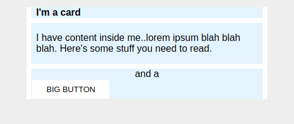

# Margin and Padding #2 

**Learning Objective:-** Use the tools learned to get relatively close to the desired output. 

NOTE: In this exercise, you'll need to change a little more than just margin and padding to make it look exactly right.

### Task:
* There is 8px between the edge of the card and its content (the blue sections).
* There is an 8px gap between each of the blue sections inside the card.
* The title of the card uses a 16px font.
* There are 8px between the title text and the edge of the title section.
* The content section has 16px space on the top and bottom, and 8px on either side.
* Everything inside the `.button-container` section is centered, and there is 8px padding.
* The Big Button is centered on its own line.
* The Big Button has 24px space on the sides, and 8px on top and bottom.

-----------------------------------------------------------

### Results and Conclusion

Seeing how the solution differed from my own attempt helped me to further understand what I learned from this lesson. I could see that I had mixed up the margin and padding elements.

I will apply this knowledge to my 'Odin Recipes' project and experiment with different values to improve my understanding.

-----------------------------------------------------------

**Below I have included the changes I needed to make to my attempt, in line with The Odin Project's solution.**

https://github.com/TheOdinProject/css-exercises/blob/main/margin-and-padding/02-margin-and-padding-2/solution/solution.css

#### Changes to style.css:

**.card:** 
* added `padding: 8px;` 

**.title:** 
* changed `margin-top` from `8px` to `0px` 
* changed `margin: 8px;` to `margin-bottom 8px;` 
* changed `padding-left` to `padding` 

**.content:** 
* changed `padding-top: 16px;` to `padding: 16px 8px;` 
* removed the other padding elements
* changed `margin` to `margin-bottom` 

**.button-container** 
* changed `margin: 8px;` to `padding: 8px;` 
* removed `margin-bottom: 8px;` 

**button:** 
* changed `padding-left: 24px;` to `padding: 8px 24px;` 
* removed the other padding elements 
* add `margin: 0 auto;` 
* removed `text-align: center;`